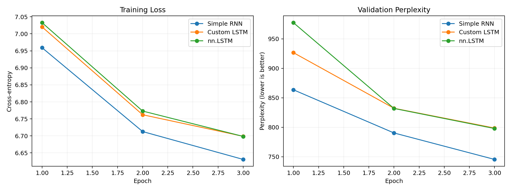

# Project 1 — From-Scratch Language Modeling Ladder

## The project in one sentence

This project trains three recurrent architectures on the same next-token task and compares their validation perplexity, speed, and parameter counts.

The models are in [models.py](models.py). The shared experiment is in [run_comparison.py](run_comparison.py). Raw numbers are in [results.json](results.json).



## What you should understand after this project

You should be able to explain:

- How next-token training examples are constructed.
- How a vanilla RNN updates its hidden state.
- What the four LSTM gates do.
- Why `nn.LSTM` is faster than a Python timestep loop.
- How cross-entropy trains a language model.
- What perplexity means.
- Why a short experiment cannot prove one architecture is universally best.

## 1. The task: next-token prediction

The corpus is divided into chunks of 50 token IDs. Each chunk becomes:

```text
chunk   = [w0, w1, w2, ..., w49]
context = [w0, w1, w2, ..., w48]
target  = [w1, w2, w3, ..., w49]
```

The model sees each token and tries to predict the following token.

For batch size `32`:

```text
context IDs       (32, 49)
target IDs        (32, 49)
embeddings        (32, 49, 50)
model logits      (32, 49, 5000)
```

To calculate cross-entropy, the batch and timestep dimensions are flattened:

```text
logits: (32 × 49, 5000) = (1568, 5000)
target: (32 × 49,)      = (1568,)
```

## 2. Shared experimental conditions

All three models used:

- The same stopword-free token chunks.
- The same deterministic 90/10 split.
- 10,550 training chunks.
- 1,173 validation chunks.
- Batch size `32`.
- Hidden size `128`.
- Learning rate `0.001`.
- Adam optimizer.
- Gradient clipping at norm `1.0`.
- The same frozen 50-dimensional `output.weight` Word2Vec matrix.
- Three training epochs.
- NVIDIA GeForce RTX 4060 Laptop GPU.

This keeps the architecture as the primary changing factor.

## 3. Model A: Simple RNN

The recurrence is:

```text
h_t = tanh(W_xh x_t + W_hh h_(t-1) + b)
y_t = W_hy h_t + b_y
```

In words:

1. Embed the current word as `x_t`.
2. Combine it with the previous hidden state.
3. Apply `tanh` to create the new hidden state.
4. Project the hidden state to 5,000 vocabulary logits.
5. Repeat for all 49 timesteps.

Its strength is simplicity. Its weakness is that repeatedly multiplying information through many timesteps can cause vanishing or exploding gradients.

## 4. Model B: Custom LSTM

The custom LSTM maintains:

- A hidden state: short-term exposed information.
- A cell state: longer-term internal memory.

At each timestep it calculates four components.

### Forget gate

```text
f_t = sigmoid(W_f [h_(t-1), x_t] + b_f)
```

Values near zero erase cell-state information; values near one preserve it.

### Input gate

```text
i_t = sigmoid(W_i [h_(t-1), x_t] + b_i)
```

This decides how much new candidate information to store.

### Candidate memory

```text
g_t = tanh(W_g [h_(t-1), x_t] + b_g)
```

This creates possible new memory content.

### Cell update

```text
c_t = f_t * c_(t-1) + i_t * g_t
```

### Output gate and hidden state

```text
o_t = sigmoid(W_o [h_(t-1), x_t] + b_o)
h_t = o_t * tanh(c_t)
```

This architecture can preserve information more selectively than a vanilla RNN.

## 5. Model C: `nn.LSTM`

PyTorch's implementation performs equivalent gated recurrent operations but packs the gates into optimized native/CUDA kernels.

Instead of executing many small Python operations for every timestep, it processes the sequence using fused low-level operations. That is why it can be dramatically faster even with nearly the same parameter count as the custom LSTM.

## 6. Cross-entropy and perplexity

Cross-entropy measures how much probability the model gives to the correct next word.

A lower loss means the correct word receives more probability.

Perplexity is:

```text
perplexity = exp(average cross-entropy)
```

An intuitive interpretation is the model's effective number of plausible choices. A perplexity of 100 means the model behaves roughly as if it is choosing among 100 similarly plausible words on average. Lower is better.

Perplexity should only be compared when tokenization, vocabulary, and evaluation data are the same.

## 7. Actual results

| Model | Best validation perplexity | Total training time | Total parameters | Trainable parameters |
|---|---:|---:|---:|---:|
| Simple RNN | **745.48** | 21.68 s | 917,912 | 667,912 |
| Custom LSTM | 798.72 | 52.91 s | 986,648 | 736,648 |
| `nn.LSTM` | 797.90 | **3.79 s** | 987,160 | 737,160 |

### Per-epoch validation perplexity

| Epoch | Simple RNN | Custom LSTM | `nn.LSTM` |
|---:|---:|---:|---:|
| 1 | 863.60 | 926.58 | 977.40 |
| 2 | 790.37 | 832.26 | 831.93 |
| 3 | **745.48** | 798.72 | 797.90 |

### Interpretation

The Simple RNN had the best perplexity after three epochs. This does **not** mean vanilla RNNs are generally better than LSTMs. Likely factors include:

- Only three epochs were run.
- The sequence length is only 49.
- The LSTMs have more parameters to optimize.
- Hyperparameters were shared for fairness rather than tuned separately.
- Stopword removal simplifies and distorts the language task.

The clearest result is computational: `nn.LSTM` completed the three epochs approximately **14 times faster** than the custom LSTM while reaching almost the same perplexity. Their parameter counts also differ by only 512 parameters.

## 8. Why stopwords are removed here

This benchmark intentionally reproduces the earlier notebook's stopword-free data. That makes it faithful to the existing work and compatible with the recovered Word2Vec vocabulary.

However, it also means this exact model cannot generate natural prose containing frequent words such as `the`, `at`, and `was`. Project 3 solves that separately with a stopword-inclusive vocabulary.

This separation is important:

- Project 1 asks for a fair architecture comparison.
- Project 3 asks for readable generation.

## 9. Correct timing on CUDA

CUDA operations are asynchronous. Starting and stopping a CPU timer without synchronization can under-report GPU time.

The experiment uses:

```python
torch.cuda.synchronize()
start = time.perf_counter()

# training work

torch.cuda.synchronize()
elapsed = time.perf_counter() - start
```

## 10. Run the project

Smoke test:

```powershell
.\.venv\Scripts\Activate.ps1
python projects\01_language_modeling_ladder\run_comparison.py --smoke-test
```

Three-epoch comparison:

```powershell
python projects\01_language_modeling_ladder\run_comparison.py --epochs 3
```

The smoke test checks shapes, gradients, CUDA execution, and a small number of batches before a full run.

## 11. Read the code in this order

In [models.py](models.py):

1. `make_embedding`
2. `SimpleRNN`
3. `CustomLSTM`
4. `BuiltinLSTM`

Then in [run_comparison.py](run_comparison.py):

1. `NextTokenDataset`
2. `load_project2_choices`
3. `evaluate`
4. `train_one_model`
5. `main`

## 12. Interview explanation

> I implemented a vanilla RNN and all four LSTM gates directly in PyTorch, then compared them with `nn.LSTM` on the same next-token task. All models used identical pretrained frozen embeddings, data splits, hidden sizes, and optimization settings. In a three-epoch run the RNN reached the lowest early validation perplexity, but the fused PyTorch LSTM trained about fourteen times faster than my Python-loop LSTM while producing nearly identical LSTM perplexity. I treated the RNN result as a short-run observation, not a universal architecture conclusion.

## Questions you should be ready to answer

- Why are input and target shifted by one token?
- What information does an RNN hidden state carry?
- What problem do LSTM gates address?
- Why is `sigmoid` useful for gates?
- Why is `tanh` used for candidate memory?
- Why is `nn.LSTM` faster than the custom LSTM?
- What is perplexity, and when is it comparable?
- Why doesn't this three-epoch result prove RNNs are better?

