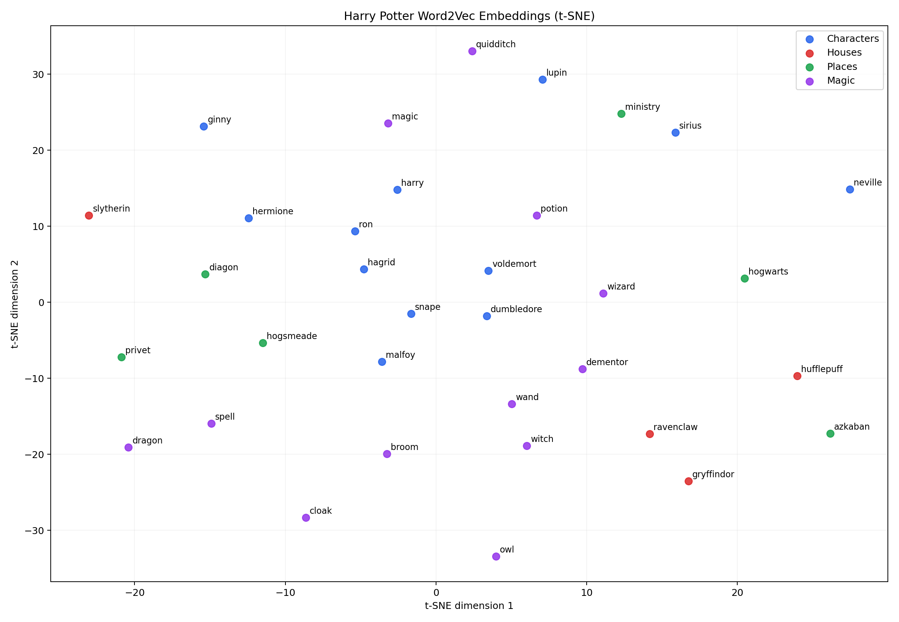

# Project 2 — Word2Vec Embedding Quality Evaluation

## The project in one sentence

This project loads the CBOW Word2Vec model already trained in the repository and asks whether its learned 50-dimensional word vectors contain useful relationships.

The complete executable is [run.py](run.py). Raw outputs are in [results.json](results.json).



## What you should understand after this project

You should be able to explain:

- What CBOW predicts.
- Why a window size of `2` creates four input words.
- The difference between an embedding and a one-hot token ID.
- Why cosine similarity is used for nearest neighbors.
- How vector arithmetic is used for analogies.
- Why `embedding.weight` and `output.weight` are different matrices.
- Why a colorful t-SNE plot does not automatically prove good embeddings.

## 1. What CBOW is doing

CBOW means **Continuous Bag of Words**. It receives surrounding context words and predicts the missing center word.

With window size `2`, this sentence fragment:

```text
harry looked [at] the door
```

can conceptually produce:

```text
context = [harry, looked, the, door]
target  = at
```

The model does not use word order inside the context representation. It embeds all four words and averages them.

The tensor flow is:

```text
context token IDs       (B, 4)
embedding lookup        (B, 4, 50)
mean across context     (B, 50)
output logits           (B, 5000)
```

For batch size `32`:

```text
(32, 4) → (32, 4, 50) → (32, 50) → (32, 5000)
```

The final 5,000 logits are unnormalized scores for every vocabulary word. Cross-entropy rewards the model when the true center word receives a high score.

## 2. Reconstructing the vocabulary

The checkpoints contain weights but not their word-to-index dictionaries. The project reproduces the original notebook preprocessing:

```text
lowercase
→ split into sentences
→ split into words
→ remove English stopwords
→ retain alphabetic tokens
→ keep the 4,999 most frequent words
→ prepend <UNK>
```

The result contains exactly 5,000 entries. The most frequent entries begin with:

```text
<UNK>, harry, said, ron, potter, hermione, page, rowling, dumbledore...
```

`<UNK>` represents every word outside the top 4,999.

### A reproducibility lesson

The draft guide claimed 82,268 sentences. This exact corpus and local NLTK 3.8.1 environment produced **62,821** sentence segments. Tokenizer versions and text normalization can change sentence boundaries. For this reason, the result page reports the value produced by the executable code rather than preserving an expected number.

## 3. The two learned matrices

The CBOW model has two large matrices:

```python
self.embedding = nn.Embedding(5000, 50)
self.output = nn.Linear(50, 5000)
```

### `embedding.weight`

This matrix converts context-word IDs into vectors. These are the input-side embeddings.

### `output.weight`

This matrix contains one learned output vector per possible target word. It helps convert the averaged context vector into 5,000 prediction scores.

Both matrices have shape `(5000, 50)`, but they play different roles and are not guaranteed to have identical semantic geometry.

The project evaluates both instead of silently picking one. Under the simple within-category cosine heuristic:

| Matrix | Category cohesion score |
|---|---:|
| `embedding.weight` | 0.0733 |
| `output.weight` | **0.8133** |

The output matrix was selected for the visualization and downstream initialization. However, many output vectors have very high similarities around `0.9`, so the high cohesion score should not be interpreted as proof of perfect semantic separation.

## 4. Checkpoint comparison

The repository contains:

```text
checkpoin1t.pth
checkpoint.pth
sentence-tokenised.pth
```

Although their serialized file hashes differ, direct tensor comparison found that every corresponding model tensor is identical. Therefore they are three serialized copies of the same learned weights, not three meaningfully different models.

All three produced the same CBOW loss on the first 10,000 deterministic examples:

| Checkpoint | CBOW loss | Approximate perplexity |
|---|---:|---:|
| `checkpoin1t.pth` | 9.0217 | 8,281.09 |
| `checkpoint.pth` | 9.0217 | 8,281.09 |
| `sentence-tokenised.pth` | 9.0217 | 8,281.09 |

This loss is worse than the `ln(5000) ≈ 8.52` uniform baseline on that evaluation slice. Possible explanations include weak training, preprocessing/index differences from the original training environment, or poor generalization to this deterministic slice. The project does not hide this result.

## 5. Nearest neighbors

Cosine similarity measures the angle between two vectors:

```text
cosine(a, b) = (a · b) / (||a|| ||b||)
```

Some output-matrix neighbors were meaningfully related:

```text
ron       → came, hagrid, weasley, george, wizarding
dumbledore → snape, voldemort, hall, fudge, hagrid
voldemort → dumbledore, snape, enemies
```

Other neighbors were weak or generic. This tells us the embeddings captured some co-occurrence information but not clean human-like semantic categories.

## 6. Analogies

An analogy creates a new vector:

```text
vector = A - B + C
```

It then finds vocabulary vectors closest to that result.

Actual top results included:

```text
harry - gryffindor + slytherin
→ hermione, swept, greater, neither, wise

dumbledore - hogwarts + azkaban
→ line, tragic, secure, stone, catching

harry - ron + hermione
→ magorian, beam, bed, bore, broke
```

These are not strong relational analogies. That is a valid result. The likely reasons are:

- The corpus is small compared with standard Word2Vec training corpora.
- It contains only one fictional domain.
- CBOW averaging loses word order.
- No frequent-word subsampling or negative-sampling improvement was implemented.
- The saved checkpoint may not be sufficiently trained.

## 7. Understanding the t-SNE plot

t-SNE converts the 50-dimensional vectors into two dimensions for visualization.

It attempts to preserve local neighborhoods, but:

- The axes have no semantic meaning.
- Global distances can be misleading.
- Different random seeds can change the layout.
- A nearby pair is suggestive, not proof of a linguistic relationship.

The plot shows a few plausible local relations, such as Harry/Ron/Hermione occupying a related area, but the four houses do not form a clean cluster. That matches the weak analogy performance.

## 8. Run the project

From the repository root:

```powershell
.\.venv\Scripts\Activate.ps1
python projects\02_word2vec_eval\run.py
```

The script writes:

- `results.json`
- `vocabulary.json`
- `word2vec_tsne.png`

## 9. Read the code in this order

In [run.py](run.py), read:

1. `SimpleW2V`
2. `make_eval_examples`
3. `cbow_loss`
4. `nearest_neighbors`
5. `analogy`
6. `cohesion_score`
7. `create_tsne_plot`
8. `main`

## 10. Interview explanation

A concise explanation is:

> I evaluated a CBOW Word2Vec model trained on a domain-specific book corpus. I reconstructed its 5,000-word vocabulary using the original preprocessing, compared its input and output embedding matrices, measured nearest neighbors and analogy behavior, and visualized selected words with t-SNE. The output matrix showed stronger category cohesion, but analogy quality and CBOW evaluation loss were weak. That taught me to validate embeddings quantitatively and qualitatively instead of assuming a saved checkpoint is useful.

## Questions you should be ready to answer

- Why are there four context words when the window size is two?
- Why does CBOW discard context order?
- What is the difference between a token ID and an embedding?
- Why use cosine similarity instead of Euclidean distance?
- Why can input and output embeddings behave differently?
- Why is t-SNE not an evaluation metric by itself?
- What would you change to improve these embeddings?

